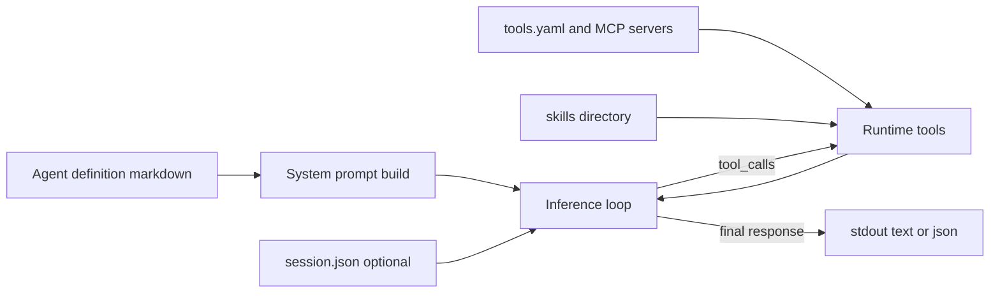

# Atoma

Atoma is a stateless MCP orchestrator CLI for running agent definitions against LLM providers and tool servers.

Atoma core is the Rust binary in this repository. Agent templates, skills, and workflow automation for GitHub delivery live in a separate repository: https://github.com/yuma-seno/atoma-autonomous-delivery.

## Quick start

```bash
# 1) Build the CLI
cargo build

# 2) Generate a starter config (optional)
cargo run -- init > atoma.toml

# 3) Create a minimal agent definition
cat > agent.md <<'MD'
---
name: assistant
description: Answer the user's request directly.
model: openai/gpt-5-mini
callable_by:
  - user
---
MD

# 4) Validate the definition
cargo run -- validate --agent-def agent.md

# 5) Run with a prompt file
echo "Summarize the purpose of this repository in 3 bullets." > prompt.txt
OPENAI_API_KEY=your_key_here cargo run -- run --agent-def agent.md --prompt-file prompt.txt
```

Success means the command prints an assistant response (default text mode) and exits with code 0.

## Choose your path

| I want to... | Go to |
| --- | --- |
| Run my first agent | [docs/getting-started.md](docs/getting-started.md) |
| Configure files, profiles, and providers | [docs/configuration.md](docs/configuration.md) |
| Write agent definitions correctly | [docs/agents.md](docs/agents.md) |
| Connect MCP tools and use skills | [docs/tools-and-skills.md](docs/tools-and-skills.md) |
| Understand runtime behavior and failure modes | [docs/runtime.md](docs/runtime.md) |
| Contribute to Atoma core | [CONTRIBUTING.md](CONTRIBUTING.md) |

## Mental model



## Production concerns

- Provider and credential resolution is explicit. See [docs/configuration.md](docs/configuration.md).
- Tool hooks can fail closed before execution, and fail open after execution. See [docs/tools-and-skills.md](docs/tools-and-skills.md).
- Session persistence is file-based and opt-in through `--in-session` and `--out-session`. See [docs/runtime.md](docs/runtime.md).
- `max_iterations` guard exits with status code 2 after saving session when possible. See [docs/runtime.md](docs/runtime.md).

## License

MIT. See [LICENSE](LICENSE).
